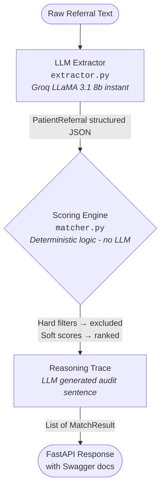

# UB Healthcare — Care Placement Intelligence Engine

An AI-enabled REST API that structures unstructured NHS patient referrals
and matches them to care providers using a **deterministic scoring engine**
with LLM-generated audit trails for clinical governance compliance.

Built as a portfolio prototype demonstrating domain-relevant AI engineering
for the UB Healthcare KTP Associate role at Birmingham City University.

---

## Architecture



**Key design principle:** The LLM extracts and narrates — it never scores or filters. All clinical decisions use deterministic logic.

---

## Streamlit Dashboard

A demo frontend (`dashboard.py`) ships alongside the API. It calls the live
FastAPI endpoints and provides a visual interface for the full placement workflow.

| Page | Description |
|---|---|
| **Full Pipeline** | Paste an NHS referral → ranked provider cards with scores, CQC badges, cost, and LLM audit trace |
| **Extract Only** | Calls `/api/v1/extract-referral` in isolation — shows each extracted field as metric cards |
| **Provider Browser** | Visualises the mock provider database with availability, specialisms, and CQC ratings |
| **Architecture** | Pipeline stage breakdown, endpoint reference, and provider switching table |

Run the dashboard:

```bash
# Terminal 1 — API backend
uvicorn app.main:app --reload

# Terminal 2 — Streamlit frontend
streamlit run dashboard.py
```

- Dashboard → `http://localhost:8501`
- Swagger UI → `http://localhost:8000/docs`

---

## Endpoints

| Method | Endpoint | Description |
|---|---|---|
| GET | `/health` | System health check |
| POST | `/api/v1/extract-referral` | Extract structured data from raw referral text |
| POST | `/api/v1/match-providers` | Match a structured referral to providers |
| POST | `/api/v1/full-pipeline` | Extract + match in a single call |

Interactive documentation: `http://localhost:8000/docs`

---

## Provider Switching

This project uses Groq's free-tier API by default. Because it uses the
standard `openai` Python SDK with a custom `base_url`, switching providers
requires only updating environment variables:

| Provider | `base_url` | `api_key` env var |
|---|---|---|
| **Groq** (default) | `https://api.groq.com/openai/v1` | `GROQ_API_KEY` |
| OpenAI | `https://api.openai.com/v1` | `OPENAI_API_KEY` |
| Gemini | `https://generativelanguage.googleapis.com/v1beta/openai/` | `GEMINI_API_KEY` |
| Local (Ollama) | `http://localhost:11434/v1` | `ollama` |

---

## Setup

```bash
git clone https://github.com/Anish06-crypto/ub-healthcare-engine
cd ub-healthcare-engine
python3.11 -m venv venv
source venv/bin/activate
pip install -r requirements-backend.txt   # FastAPI + pydantic + groq + SQLAlchemy
cp .env.example .env  # Add your GROQ_API_KEY
```

> **Note on `requirements.txt`:** This file contains only the Streamlit dashboard
> dependencies (`streamlit`, `pandas`, `requests`) so that Streamlit Community Cloud
> can deploy without triggering a pydantic-core Rust compilation.
> The full backend stack lives in `requirements-backend.txt`.

---

## Running Tests

```bash
pytest tests/ -v
```

16 tests — 10 deterministic unit tests (no API calls), 6 integration tests
against the live Groq API.

---

## Clinical Governance

See [GOVERNANCE.md](GOVERNANCE.md) for data minimisation, auditability,
and NHS compliance design decisions.

---

## Limitations

This is a prototype built with mock data. See [GOVERNANCE.md](GOVERNANCE.md) for a full
list of what would be required before clinical use.

---
